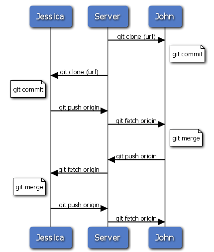
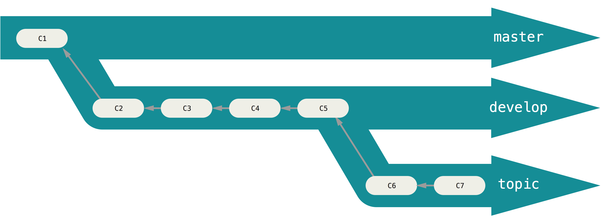

---
jupyter:
  jupytext:
    cell_metadata_filter: -all
    formats: md,notebooks//ipynb
    text_representation:
      extension: .md
      format_name: markdown
      format_version: '1.2'
      jupytext_version: 1.6.0
  kernelspec:
    display_name: Python 3
    language: python
    name: python3
---

# Git

Git est un logiciel de gestion de versions.

Site officiel https://git-scm.com

Le livre en français https://git-scm.com/book/fr/v2


## Pourquoi un gestionnaire de version

- Toutes les modifications sont enregistrées.
- A tout moment vous pouvez revenir sur une version précédente.
- Vous pouvez l'utiliser pour quasiment tous les types de fichier.
- C'est la meilleure approche pour collaborer sur un document tex.
- Chaque modification est identifiée et datée.
- Ne convient pas aux fichiers volumineux souvent modifiés
- N'est pas adapté aux formats non lisibles en mode texte comme le pdf, word ou excel.


## GitHub

- Service web appartenant à Microsoft utilisant Git comme gestionnaire de version. 
- Github permet de collaborer toutes les étapes de développement d'un logiciel ou de la rédaction d'un document au format texte au cours du temps.
- Github permet d'organiser cette collaboration avec différents niveaux d'accès, la gestion des bugs, l'hébergement de la documentation et une mécanisme d'intégration continue.
- Github est la plus grande bibliothèque de codes du monde et on y retrouve les meilleures développeurs.
- Fonctionne de plus en plus comme un réseau social et offre une grande visibilité à vos travaux.

Service équivalent: [Bitbucket](https://bitbucket.org)

## Gitlab

- Forge officielle : [Gitlab.com](https://about.gitlab.com) 
- Gitlab permet d'herberger sa propre instance.
- Beaucoup d'institutions proposent des instances Gitlab
   * PLM <https://plmlab.math.cnrs.fr> (pages, CI)
   * INRIA <https://gitlab.inria.fr> (pages, CI)
   * Université de Rennes 1 <https://gitlab.univ-rennes1.fr> (~~pages~~, ~~CI~~)
   * INSA Rennes <https://gitlab.insa-rennes.fr>(~~pages~~, ~~CI~~)


## Gestion distribuée des versions


- Chaque membre du projet possède une copie totale du projet
- On peut contribuer seul ou à plusieurs.
- Pas besoin de connexion réseau
- Les sauvegardes sont très nombreuses grâce à ce système.


## Installation et configuration

- Télécharger et installer [Git](http://git-scm.com).
- Configuration: Il faut renseigner votre identité avec votre adresse de messagerie. 

Ouvrir la console « Git bash »:

<!-- #region -->
```bash
git config --global user.name “Pierre Navaro"
git config --global user.email “pierre.navaro@univ-rennes1.fr`
```
<!-- #endregion -->

Utiliser la même adresse que pour votre compte GitHub. Verifier la configuration avec:

<!-- #region -->
```bash
git config --list
```
<!-- #endregion -->

## Créer sa clé SSH

Saisissez la ligne suivante dans le git bash:

<!-- #region -->
```bash
ssh-keygen
```
<!-- #endregion -->

Valider les questions suivantes :

```
Enter file in which to save the key (/****/****/.ssh/id_rsa):
```
appuyer sur « enter » ou saisir le nom du certificat puis « enter »

```
Enter passphrase (empty for no passphrase):
```

Appuyer sur "enter" (conseillé) ou saisir un mot de passe.  Deux fichiers on été créés : un clé publique et une clé privée. La clé publique sera celle que l'on pourra partager et la clé privée ne doit être communiquée sous aucun prétexte, elle est comme un mot de passe. Si vous la perdez vous devrez recommencer la procédure.


## Créer votre compte GitHub et GitLab

GitHub: Il suffit de cliquer en haut à droite sur `Sign Up`. Ajouter votre clé publique dans votre profile (Settings -> SSH and GPG keys -> New SSH key)

Gitlab: En haut à droite, dans le profile il y a un menu `Settings` qui contient un onglet `SSH Keys`.

## Clonage d'un dépôt git
<!-- #region -->
```bash
git clone git@plmlab.math.cnrs.fr:irmar/git-markdown-docker.git
ls git-markdown-docker
```
<!-- #endregion -->
Vous aurez une copie de ces transparents sur votre ordinateur.

## Mettre en place un dépôt git local

Créons un nouveau répertoire où nous nous allons ajouter un fichier README:

<!-- #region -->
```bash
cd $HOME
mkdir monprojet
cd monprojet
touch README.md
echo "# Mon Projet " >> README.md
ls
```
<!-- #endregion -->

Création du dépôt git:
<!-- #region -->
```bash
git init
git status
```
<!-- #endregion -->


## Ajouter un fichier dans l'index

<!-- #region -->
```bash
touch index.m`
```
<!-- #endregion -->

<!-- #region -->
```bash
git status
```
<!-- #endregion -->

La commande `add` est nécessaire pour un nouveau fichier mais aussi pour un fichier qui a été modifié.

<!-- #region -->
```bash
git add index.md
echo "# Titre du projet" >> index.md
```
<!-- #endregion -->

<!-- #region -->
```bash
git status
```
<!-- #endregion -->

## Validation et sauvegarde (commit)

<!-- #region -->
```bash
git commit -m 'Create the file index.md'
```
<!-- #endregion -->

<!-- #region -->
```bash
git status
```
<!-- #endregion -->

## Les différents états des fichiers dans la copie du dépôt
  


## Mettre le dépôt sur GitHub

Créer un dépot github, que nous appelerons `mon_projet` :
- Cliquer sur le '+' en haut à droite et "New repository"
- Repository name = "mon_projet"
- Laisser les options par défaut
- Cliquer sur "Create repository"

<!-- #region -->
```bash
git remote add origin git@github.com:{GITHUB_LOGIN}/mon_projet.git
git push -u origin master
```
<!-- #endregion -->
Remplacer `{GITHUB_LOGIN}` par votre login github.

<!-- #region -->
```bash
git status
```
<!-- #endregion -->

## Synchroniser avec la version distante sur le dépôt

Vous pouvez modifier les fichiers directement sur le site GitHub.
La commande suivante permet de rappatrier toutes les modifications sur le dépôt distant (remote) sans modifier
votre version locale. Toutes les branches commencant par "origin/\*" seront mises à jour.

<!-- #region -->
```bash
git fetch origin
```
<!-- #endregion -->

<!-- #region -->
```bash
git branch -`
```
<!-- #endregion -->

<!-- #region -->
```bash
git status
```
<!-- #endregion -->

## Mettre à jour le dépôt distant

Modifier ou créer un fichier et effectuer un nouveau commit.

Votre `commit` sera téléversé sur le serveur git
- `origin` correspond au dépôt distant
- `master` la branche que vous souhaitez mettre à jour

par défaut vous êtes sur la branche "master"

<!-- #region -->
```bash
git branch -`
```
<!-- #endregion -->

"Pousser" vos fichiers sur le serveur.

<!-- #region -->
```bash
git push origin master
```
<!-- #endregion -->

## Git Workflow


## Fusionner la branche distante avec la branche locale

Si la version distante est en avance sur la version locale, il existe différentes manières de récupérer les modifications:

<!-- #region -->
```bash
git fetch origin
git merge origin/master
```
<!-- #endregion -->

Les deux étapes précédentes peuvent être effectuées en une seule commande avec

<!-- #region -->
```bash
git pull origin master
```
<!-- #endregion -->

Je déconseille cette approche car avec le `git fetch` on peut anticiper des conflits avec

<!-- #region -->
```bash
git diff origin/master
```
<!-- #endregion -->
ou en version graphique si l'outil est installé sur votre poste:

<!-- #region -->
```bash
git difftool origin/master
```
<!-- #endregion -->

## Résoudre les conflits

- Cette outil permet de choisir les modifications lorsqu'un fichier a été modifié au même endroit.

<!-- #region -->
```bash
git mergetool
```
<!-- #endregion -->

- En cas de problèmes sur un fichier, vous pouvez annuler toutes les modifications non validées par un *commit* avec :

<!-- #region -->
```bash
git checkout mon_fichier_modif
```
<!-- #endregion -->

- Si vraiment il y a de gros soucis

<!-- #region -->
```bash
git reset --hard
```
<!-- #endregion -->

Attention cette dernière commande, annule tous les changements qui n'ont pas été validés par un *commit*.


## Afficher les branches

<!-- #region -->
```bash
git branch -a
```
<!-- #endregion -->

## Créer une branche

Permet de "figer" une version personnelle locale sur laquelle vous pouvez travailler sans modifier la branche principale "master".

<!-- #region -->
```bash
git branch mabranche
git checkout mabranche
git branch
```
<!-- #endregion -->

Des fichiers peuvent être différents ou meme inexsitants dans deux branches distinctes mais ils se trouveront au même endroit dans le système de fichiers.


## Afficher les modifications sur un fichier

<!-- #region -->
```bash
date >> README.md
```
<!-- #endregion -->

<!-- #region -->
```bash
git status
```
<!-- #endregion -->

<!-- #region -->
```bash
git diff
```
<!-- #endregion -->

## Enregister les modifications

<!-- #region -->
```bash
git add README.md
```
<!-- #endregion -->

<!-- #region -->
```bash
git status
```
<!-- #endregion -->

<!-- #region -->
```bash
git commit -m 'Add today date in README'
```
<!-- #endregion -->

## Commit


## Fast commit


## Partager votre travail sur le serveur

### Option 1 : fusionner sur la branche principale et pousser

<!-- #region -->
```bash
git checkout master
git merge mabranche
git push origin master
```
<!-- #endregion -->

## Partager votre travail sur le serveur


## Option 2 : Pousser la branche locale sur le serveur

<!-- #region -->
```bash
git checkout mabranche
git push origin mabranche
```
<!-- #endregion -->

## Mise à jour depuis le dépôt distant

<!-- #region -->
```bash
git checkout master
git fetch origin
git merge origin/master
```
<!-- #endregion -->

<!-- #region -->
```bash
git checkout mabranche
git merge master
```
<!-- #endregion -->

Si votre branche locale n'est pas présente sur le serveur, vous pouvez utiliser `rebase` à la place de `merge`. Cette opération permet de récrire l'historique en datant vos modifications postérieures à la dernière modification de la branche master.


## Cycle 




## Développement pour garantir la stabibité




## Stash

Permet d'enregistrer l'état de vos fichiers sans enregistrer les modifications par un `commit`.
Modifiez un fichier sans effectuer de commit et entrez les commandes suivantes:

<!-- #region -->
```bash
git stash
git stash show
```
<!-- #endregion -->

### Appliquer un `stash`

<!-- #region -->
```bash
git stash pop
```
<!-- #endregion -->

### Supprimer un `stash`

<!-- #region -->
```bash
git stash drop
```
<!-- #endregion -->

## Pourquoi Git ?

- Tracer et controler les modifications dans un logiciel.
- Branches : Développement dédié pouvant fonctionner en paralléle.
- Tout est local : Git est rapide.
- Des sauvegardes trés nombreuses.
- Cette distinction local-distant offre plus de sécurité
- Le mécanisme des `pull request` favorise la relecture et est une garantie supplémentaire de stabilité.


## Pourquoi pas

- Difficile à apprendre pour les utilisateurs de cvs et subversion qui sont moins puissants mais plus simples et souvent suffisants dans beaucoup de cas.
- Syntaxe en ligne de commande un peu folle et parfois confuse.
- Il faut parfois enchainer beaucoup d'instructions pour des opérations assez simples.
- L'historique créé par git est parfois étrange, certaines modifications peuvent changer d'auteur.
- On peut détruire le dépôt distant involontairement.
- Offre beaucoup de confort au responsable de la maintenance du code au détriment des contributeurs.


## Quelques commandes utiles

- Quels fichiers différent dans deux branches distinctes ?

<!-- #region -->
```bash
git diff --name-status master..mabranche
```
<!-- #endregion -->

- Comparer la version sur la branche principale avec une autre branche

<!-- #region -->
```bash
git diff mabranche master -- intro.md
```
<!-- #endregion -->

## .gitignore

Si votre dépôt contient un fichier `.gitignore` avec une liste de fichiers, les modifications de ces fichiers seront ignorés par git. Je conseille de supprimer ces fichiers de l'historique avant de les ignorer.

- Pour effacer tous les fichiers ignorés (à faire après un commit)

<!-- #region -->
```bash
git clean -xdf
```
<!-- #endregion -->


## Ignorer tous les changements et revenir au point de départ

- Sur un fichier
<!-- #region -->
```bash
git checkout README.md
```
<!-- #endregion -->
- Pour revenir au point de départ

<!-- #region -->
```bash
git reset --hard
```
<!-- #endregion -->


## Utiliser git plus facilement

- [GitHub Desktop](https://desktop.github.com/)
- [Sourcetree](https://fr.atlassian.com/software/sourcetree)
- [GitKraken](https://www.gitkraken.com/)
- [Fork](https://git-fork.com)
- [Plugin RStudio](https://www.rstudio.com/)
- [Plugin Eclipse](https://www.eclipse.org/downloads/)
- [Produits JetBrains](https://www.jetbrains.com/)
